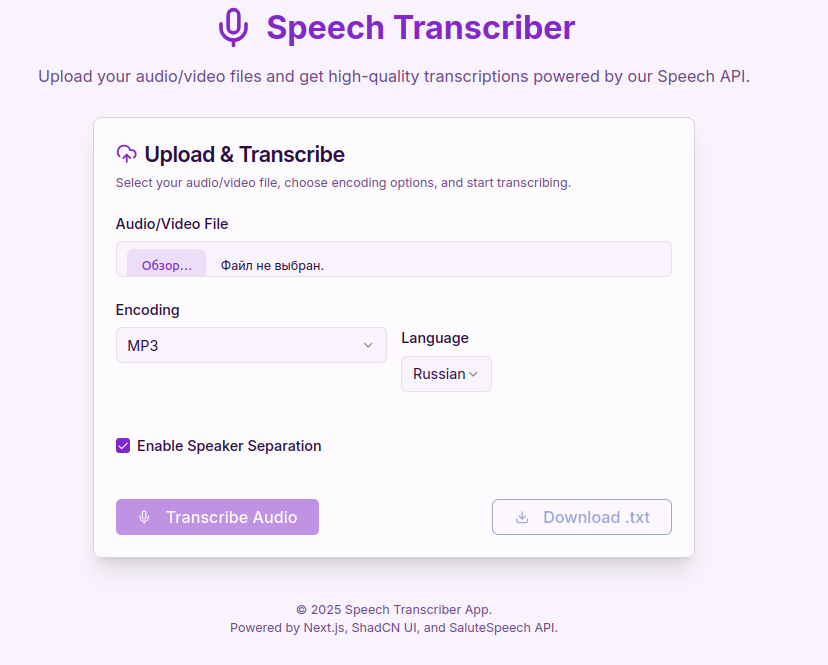

# Speech Transcriber

This is a NextJS app maded in Firebase Studio.
This project is a web application that allows users to upload audio files and get a transcription of the audio using a speech-to-text service.
It also provides the functionality to download the transcription as a text file.



## Features

- Upload audio files
- Get transcription of the uploaded audio
- Download the transcription as a text file
- Option to separate transcription by speaker

## Setup and Local Development

To run this project locally, you will need Docker and Docker Compose installed.

1.  **Clone the repository:**
```bash
git clonehttps://github.com/bazhil/SpeechTranscriber.git
```

2. **Fill .env:**
```bash
SPEECH_BASE_URL=https://smartspeech.sber.ru/rest/v1
SPEECH_TOKEN_URL=https://ngw.devices.sberbank.ru:9443/api/v2/oauth
MAX_WAIT_TIME=300000
RECOGNITION_POLLING_DELAY=1000
SPEECH_AUTH_KEY=
SPEECH_AUTH_SECRET=
SPEECH_CLIENT_ID=
RETRY_ATTEMPTS=5
RETRY_TIMEOUT=2
NODE_TLS_REJECT_UNAUTHORIZED=0
```

3. **Run project using docker:**
```bash
docker compose up
```
or
```bash
docker compose up --build
```
...if you have add some changes.

For stop docker container use:
```bash
docker compose down
```


Project use MIT [LICENSE](LICENSE)